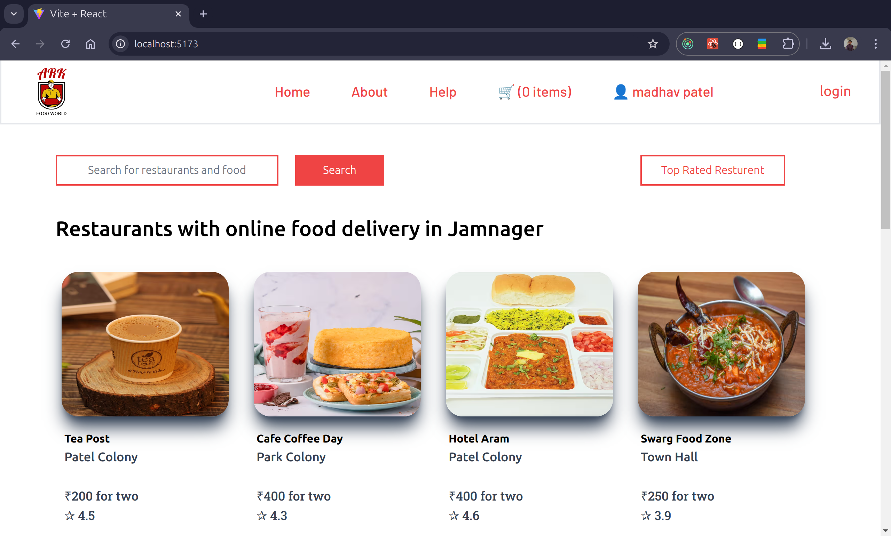
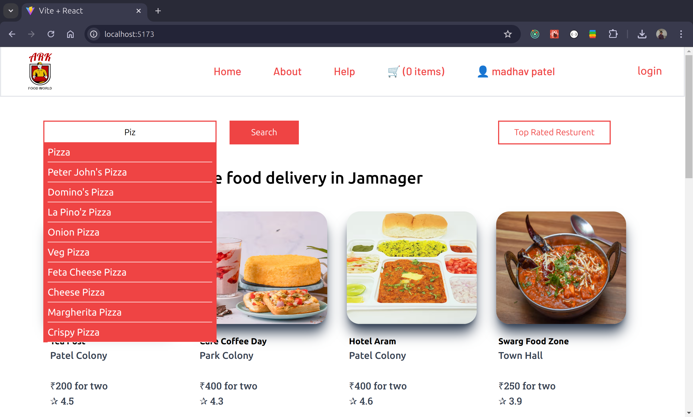
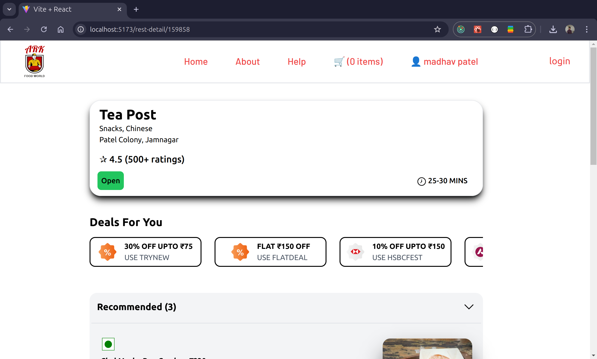
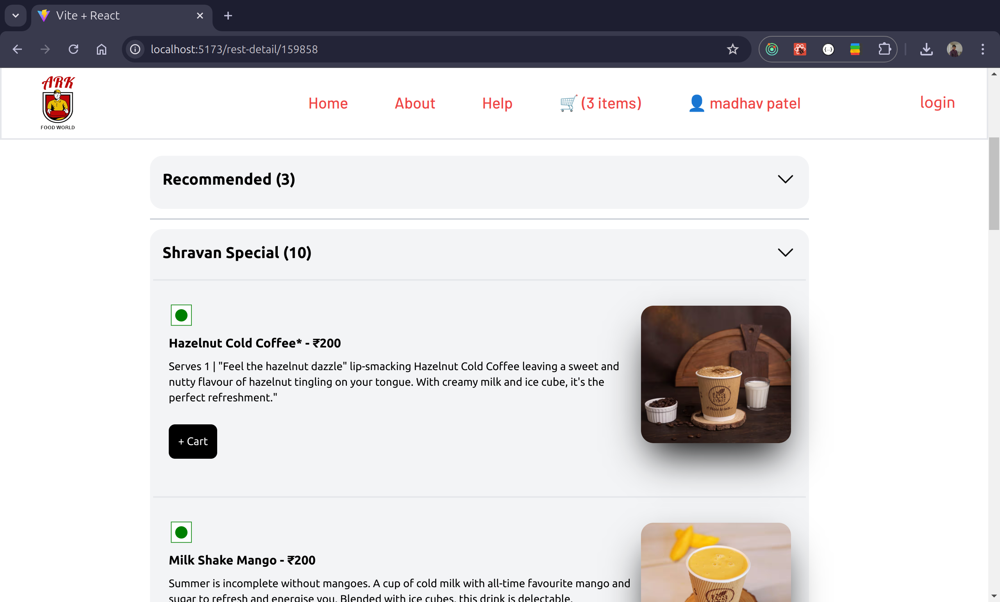
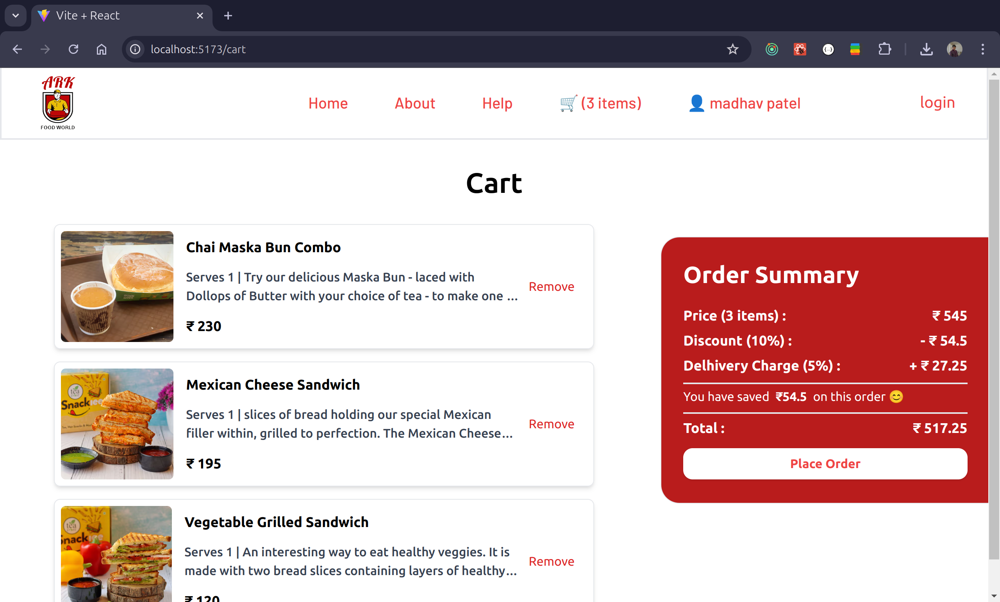
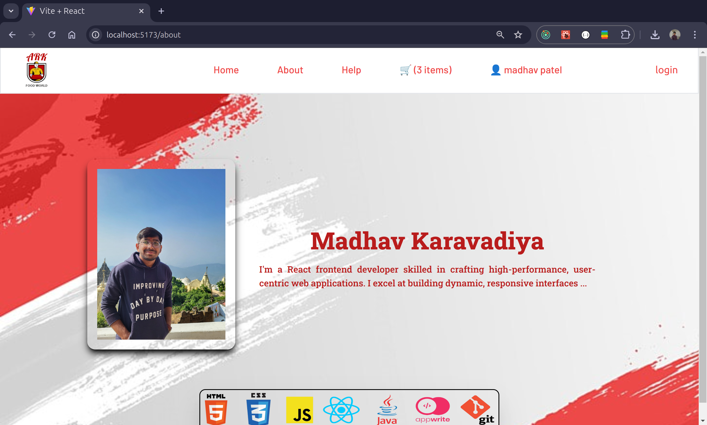

# ARK FoodWorld

In this Project we use the swiggy API and make a food ordering app with the scratch.

This website is build based on the React in which we start at the beginner level and go to the Advanced level.

For an optimal experience, please access the website in desktop view, as it is currently not responsive. 👀

## Technologies Used

- React
- React-Router
- Redux
- Teilwind CSS

## Concepts Covered:

- API fetching from the swiggy real time API & many others API,
- filter the data from the API,
- Dom manipulation, 
- reconciliation in React,
- Shimmer UI,
- props Drilling.
- react-router, 
- Types of routings, 
- dynamic routing based on the unique id's 
- higher order component
- controlled - Uncontrolled components / lifting state up
- Context API
- lazy loading and Suspense 
- debouncing 
- Catching 
- N levels nested comments
- etc...

<!-- ## features:  -->

## Installation

### Clone the repository

```
git clone https://github.com/madhavpatel236/ARK-FoodWorld.git
cd ARK-FoodWorld
LOCALHOST= http://localhost:5173/
```

### Install dependencies

```
cd ARK-FoodWorld
npm install
```

### Start the project

```
npm run dev
```
## ScreenShots of the Project


#

#

#

#

#


`Because of the CORS Problem site is not deployed `