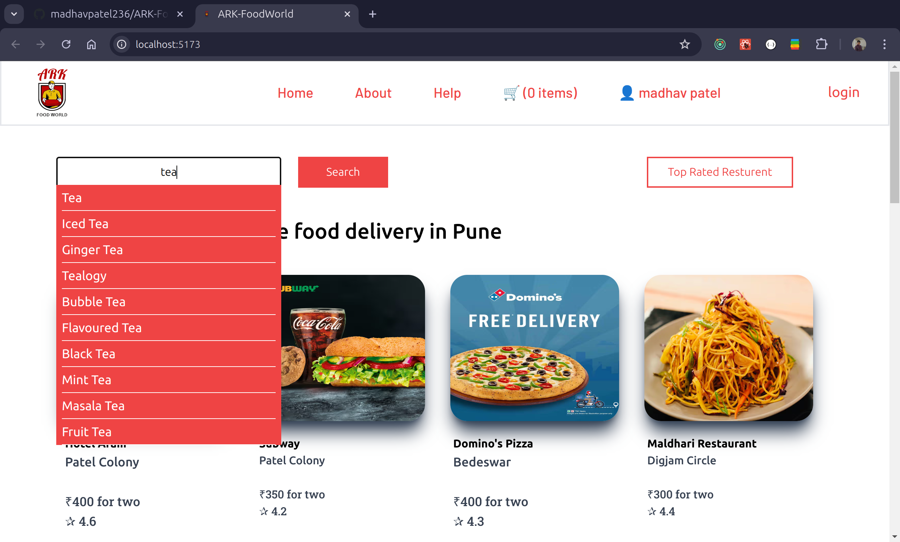

# ARK FoodWorld

ARK FoodWorld is a food ordering app built from scratch using the Swiggy API, designed to take users from beginner to advanced levels in React development. Please note that the website is best experienced in desktop view, as it is currently not responsive.

## Technologies Used

- React
- React-Router
- Redux
- Teilwind CSS

## Concepts Covered

- **API Integration** : Fetching real-time data from the Swiggy API and other external APIs.
- **Data Filtering**: Implementing complex data filtering techniques from API responses.
- **DOM Manipulation**: Mastering DOM updates and reconciliation in React.
- **Shimmer UI**: Creating a skeleton screen using Shimmer UI for improved user experience      during data loading.
- **Props Drilling**: Understanding and managing data flow through component hierarchies.
- **React Router**: Implementing client-side routing with static, dynamic, and nested routes.
- **Higher-Order Components (HOC)**: Enhancing components with HOCs for code reuse.
- **Controlled and Uncontrolled Components**: Managing form state effectively, with state lifting as needed.
- **Context API**: Using Context API to manage global state without prop drilling.
- **Lazy Loading & Suspense**: Optimizing performance with code-splitting and lazy loading components.
- **Debouncing**: Implementing debouncing for performance optimization during high-frequency events.
- **Caching**: Enhancing data fetching efficiency with caching strategies.
<!-- - Nested Comments: Building complex UIs with N-levels deep nested comments. -->


<!-- ## features:  -->

## Installation

#### Clone the repository

```
git clone https://github.com/madhavpatel236/ARK-FoodWorld.git
cd ARK-FoodWorld
```

`LOCALHOST= http://localhost:5173/`

#### Install dependencies

```
cd ARK-FoodWorld
npm install
```

#### Start the project

```
npm run dev
```

## ScreenShots of the Project


#



#


#


#


#


`Because of the CORS Problem site is not deployed`
